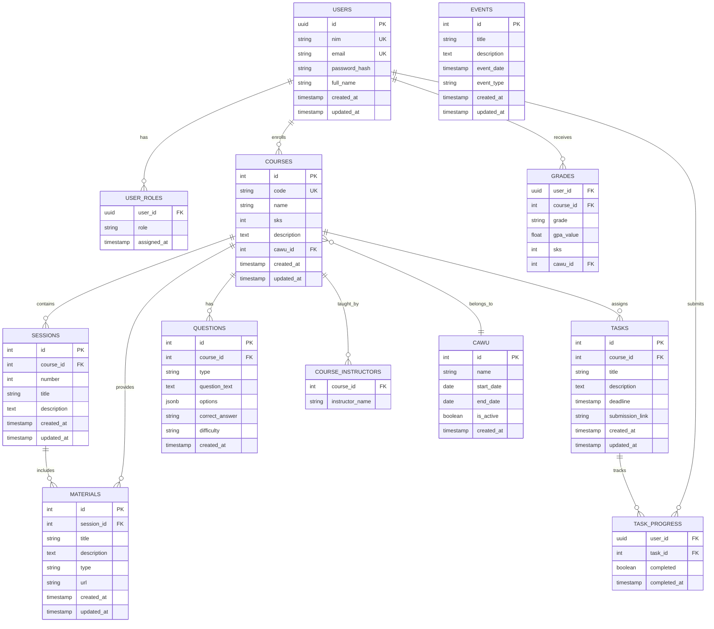

# MRT Academic - Database Schema (ERD)

## Visual ERD Diagram



## Table Descriptions

### Core Tables

#### `users`
User accounts untuk students dan admins
- **Primary Key**: `id` (UUID)
- **Unique**: `nim`, `email`
- **Relations**: Has many roles, courses, task progress, grades

#### `user_roles`
Role assignment untuk RBAC (Role-Based Access Control)
- **Composite PK**: `(user_id, role)`
- **Roles**: MAHASISWA, DOSEN, SUPER_ADMIN, KURIKULUM, SEKRETARIS, KOMTI, WAKOMTI
- **Note**: Satu user bisa punya multiple roles

#### `cawu`
Catur Wulan (semester) periods
- **Primary Key**: `id`
- **Special**: `is_active` flag untuk current semester
- **Relations**: Has many courses

### Academic Tables

#### `courses`
Mata kuliah
- **Primary Key**: `id`
- **Unique**: `code` (e.g., CS101)
- **Relations**: Belongs to cawu, has sessions/tasks/materials/questions
- **Nullable**: `cawu_id` (course bisa tanpa cawu)

#### `course_instructors`
Dosen pengajar (many-to-many)
- **Composite PK**: `(course_id, instructor_name)`
- **Note**: Satu course bisa punya multiple instructors

#### `sessions`
Pertemuan dalam course
- **Primary Key**: `id`
- **Ordering**: `number` field untuk urutan
- **Relations**: Has many materials

#### `materials`
Materi pembelajaran
- **Primary Key**: `id`
- **Types**: pdf, link, video, image
- **Relations**: Belongs to session

### Assessment Tables

#### `tasks`
Tugas/assignments
- **Primary Key**: `id`
- **Fields**: title, description, deadline, submission_link
- **Relations**: Has many task_progress records

#### `task_progress`
Tracking task completion per user
- **Composite PK**: `(user_id, task_id)`
- **Fields**: completed (boolean), completed_at
- **Relations**: Belongs to user and task

#### `grades`
Nilai dan IPK
- **Composite PK**: `(user_id, course_id)`
- **Fields**: grade (A, A-, B+, etc), gpa_value, sks
- **Relations**: Belongs to user, course, and cawu

### Question Bank

#### `questions`
Bank soal untuk latihan
- **Primary Key**: `id`
- **Types**: multiple_choice, essay, true_false
- **Fields**: question_text, options (JSONB), correct_answer, difficulty
- **Relations**: Belongs to course

### Events

#### `events`
Academic calendar events
- **Primary Key**: `id`
- **Types**: exam, meeting, holiday, deadline
- **Fields**: title, description, event_date, event_type

## Indexes & Constraints

### Unique Constraints
- `users.nim`
- `users.email`
- `courses.code`
- `(course_id, instructor_name)` in course_instructors

### Foreign Keys
All foreign keys are properly defined with CASCADE or SET NULL on delete:
- `courses.cawu_id` → `cawu.id` (ON DELETE SET NULL)
- `sessions.course_id` → `courses.id` (ON DELETE CASCADE)
- `materials.session_id` → `sessions.id` (ON DELETE CASCADE)
- `tasks.course_id` → `courses.id` (ON DELETE CASCADE)
- `task_progress.user_id` → `users.id` (ON DELETE CASCADE)
- `task_progress.task_id` → `tasks.id` (ON DELETE CASCADE)

### Check Constraints
- `courses.sks > 0`
- `materials.type IN ('pdf', 'link', 'video', 'image')`
- `grades.grade IN ('A', 'A-', 'B+', 'B', 'B-', 'C+', 'C', 'D', 'E')`
- `user_roles.role IN ('MAHASISWA', 'DOSEN', 'SUPER_ADMIN', 'KURIKULUM', 'SEKRETARIS', 'KOMTI', 'WAKOMTI')`

## Migration Files

1. **001_initial_schema.sql** - Core tables (users, courses, sessions, etc.)
2. **002_add_grade_fields_and_cawu.sql** - Add cawu system and grade fields
3. **003_fix_phase4_schema.sql** - Fix schema issues
4. **004_fix_grades_primary_key.sql** - Fix grades composite PK
5. **005_add_questions.sql** - Add question bank
6. **005_add_schema_revisions.sql** - Additional revisions
7. **006_uppercase_roles.sql** - Convert roles to UPPERCASE

## Sample Data

```sql
-- Check current data
SELECT COUNT(*) FROM users;           -- Total users
SELECT COUNT(*) FROM courses;         -- Total courses
SELECT COUNT(*) FROM tasks;           -- Total tasks
SELECT DISTINCT role FROM user_roles; -- All roles in system
```

## View ERD Online

Copy the Mermaid diagram above and paste into:
- **Mermaid Live Editor**: https://mermaid.live
- **GitHub**: Create `.md` file with the diagram
- **Notion**: Use Mermaid code block
- **Obsidian**: Use Mermaid plugin

Or use database tools:
- **DBeaver**: Connect to PostgreSQL, right-click schema → View Diagram
- **DataGrip**: Right-click schema → Diagrams → Show Visualization
- **Adminer**: Install ERD plugin
